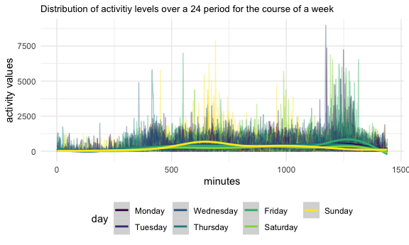
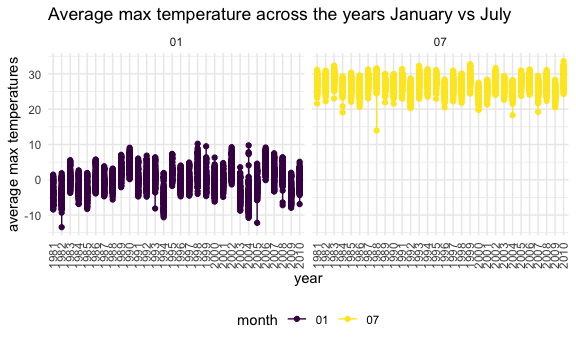
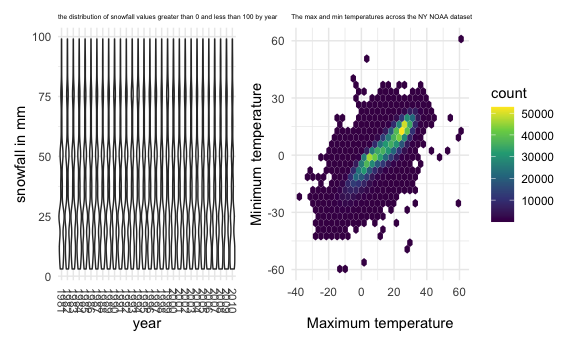

Homework 3
================
Ronae McLin rkm2147

``` r
library(tidyverse)
```

    ## ── Attaching packages ──────────────────────────────────────── tidyverse 1.3.0 ──

    ## ✓ ggplot2 3.3.2     ✓ purrr   0.3.4
    ## ✓ tibble  3.0.1     ✓ dplyr   1.0.0
    ## ✓ tidyr   1.1.0     ✓ stringr 1.4.0
    ## ✓ readr   1.3.1     ✓ forcats 0.5.0

    ## ── Conflicts ─────────────────────────────────────────── tidyverse_conflicts() ──
    ## x dplyr::filter() masks stats::filter()
    ## x dplyr::lag()    masks stats::lag()

``` r
library(patchwork)
library(ggridges)


knitr::opts_chunk$set(
  fig.width = 6,
  fig.asp = .6,
  out.width = "90%"
)
theme_set(theme_minimal() + theme(legend.position = "bottom"))

options(
  ggplot2.continuous.colour = "viridis",
  ggplot2.continuous.fill = "viridis"
)

scale_colour_discrete = scale_color_viridis_d

scale_fill_discrete = scale_fill_viridis_d
```

# Problem 1

``` r
library(p8105.datasets)
data("instacart")
```

Instacart is an online service that allows for users to shop locally
from various stores that can then be delivered within NYC. There are a
total of 1,384,617 observations contained within this dataset. This
dataset contains 1384617 rows and 15 columns. Observations are the level
of items in orders by user. Variables include: order\_id, product\_id,
add\_to\_cart\_order, reordered, user\_id, eval\_set, order\_number,
order\_dow, order\_hour\_of\_day, days\_since\_prior\_order,
product\_name, aisle\_id, department\_id, aisle, department.

**There are 134 aisles, and aisles in which the top 3 most ordered items
are ordered from are fresh vegetables, fresh fruits, and packaged
vegetables & fruits**

``` r
instacart %>% 
  count(aisle) %>% 
  arrange(desc(n))
```

    ## # A tibble: 134 x 2
    ##    aisle                              n
    ##    <chr>                          <int>
    ##  1 fresh vegetables              150609
    ##  2 fresh fruits                  150473
    ##  3 packaged vegetables fruits     78493
    ##  4 yogurt                         55240
    ##  5 packaged cheese                41699
    ##  6 water seltzer sparkling water  36617
    ##  7 milk                           32644
    ##  8 chips pretzels                 31269
    ##  9 soy lactosefree                26240
    ## 10 bread                          23635
    ## # … with 124 more rows

**Plot of items ordered from each aisle, more than 10000.**

``` r
instacart %>% 
  count(aisle) %>% 
  filter(n > 10000) %>% 
  ggplot(aes( x = aisle, y = n)) + geom_point() + theme(axis.text.x = element_text(angle = 270, vjust = 0.5, hjust = 1)) + labs(
    title = "items ordered from each aisle",
    x = "aisle",
    y = "number of items"
  )
```


**A table showing the three most popular items in each of the aisles
“baking ingredients”, “dog food care”, and “packaged vegetables
fruits”.**

``` r
instacart %>% 
    filter(aisle %in% c("baking ingredients", "dog food care", "packaged vegetables fruits")) %>% 
    group_by(aisle) %>% 
    count(product_name) %>% 
    mutate(rank = min_rank(desc(n))) %>% 
    filter(rank < 4) %>% 
    arrange(aisle, rank) %>% 
    knitr::kable()
```

| aisle                      | product\_name                                 |    n | rank |
| :------------------------- | :-------------------------------------------- | ---: | ---: |
| baking ingredients         | Light Brown Sugar                             |  499 |    1 |
| baking ingredients         | Pure Baking Soda                              |  387 |    2 |
| baking ingredients         | Cane Sugar                                    |  336 |    3 |
| dog food care              | Snack Sticks Chicken & Rice Recipe Dog Treats |   30 |    1 |
| dog food care              | Organix Chicken & Brown Rice Recipe           |   28 |    2 |
| dog food care              | Small Dog Biscuits                            |   26 |    3 |
| packaged vegetables fruits | Organic Baby Spinach                          | 9784 |    1 |
| packaged vegetables fruits | Organic Raspberries                           | 5546 |    2 |
| packaged vegetables fruits | Organic Blueberries                           | 4966 |    3 |

**A table showing the mean hour of the day at which Pink Lady Apples and
Coffee Ice Cream are ordered on each day of the week**

``` r
instacart %>% 
  filter(product_name %in% c("Pink Lady Apples", "Coffee Ice Cream")) %>% 
  group_by(product_name, order_dow) %>% 
  summarize(mean_hour = mean(order_hour_of_day)) %>% 
  pivot_wider(
    names_from = order_dow,
    values_from = mean_hour
  ) %>% 
  knitr::kable()
```

    ## `summarise()` regrouping output by 'product_name' (override with `.groups` argument)

| product\_name    |        0 |        1 |        2 |        3 |        4 |        5 |        6 |
| :--------------- | -------: | -------: | -------: | -------: | -------: | -------: | -------: |
| Coffee Ice Cream | 13.77419 | 14.31579 | 15.38095 | 15.31818 | 15.21739 | 12.26316 | 13.83333 |
| Pink Lady Apples | 13.44118 | 11.36000 | 11.70213 | 14.25000 | 11.55172 | 12.78431 | 11.93750 |

# Problem 2

Load data & tidy the data appropriately

``` r
accel_df = read_csv("./accel_data.csv") %>% 
  janitor::clean_names() %>% 
  mutate(
    day = as.factor(day)
  ) %>% 
  pivot_longer(
    activity_1:activity_1440,
    names_to = "minute",
    names_prefix = "activity_",
      values_to = "value"
  ) %>% 
  mutate(
    minute = as.numeric(minute)
  ) %>% mutate(
  weekday = if_else(day %in% c("Saturday", "Sunday"), "FALSE", "TRUE")) %>% 
  mutate(weekday = as.factor(weekday)
         ) %>%
  mutate(
    day =  
  forcats::fct_relevel(day, c("Monday", "Tuesday", "Wednesday", "Thursday","Friday","Saturday", "Sunday"))
  )
```

    ## Parsed with column specification:
    ## cols(
    ##   .default = col_double(),
    ##   day = col_character()
    ## )

    ## See spec(...) for full column specifications.

**The accelerometer data describes information collected on a 63
year-old male with congesitve heart failure. This data includes the
variables: week, day\_id, day, minute, value, weekday. The weekday
variable describes if observations occurred during the weekday (Mon-Fri)
or during the weekend (Sat-Sun). There are a total of 50400 observations
for this frame. Observations were collected for a total of 5 weeks.
There are 1440 minutes in a 24 hour period, so the amount of
observations seems appropriate**

Create activity table based on weeks

``` r
accel_df %>% 
  group_by(day, week) %>% 
  summarize(sum_value = sum(value)) %>%
  pivot_wider(
    names_from = day,
    values_from = sum_value
  ) %>% 
  knitr::kable()
```

    ## `summarise()` regrouping output by 'day' (override with `.groups` argument)

| week |    Monday |  Tuesday | Wednesday | Thursday |   Friday | Saturday | Sunday |
| ---: | --------: | -------: | --------: | -------: | -------: | -------: | -----: |
|    1 |  78828.07 | 307094.2 |    340115 | 355923.6 | 480542.6 |   376254 | 631105 |
|    2 | 295431.00 | 423245.0 |    440962 | 474048.0 | 568839.0 |   607175 | 422018 |
|    3 | 685910.00 | 381507.0 |    468869 | 371230.0 | 467420.0 |   382928 | 467052 |
|    4 | 409450.00 | 319568.0 |    434460 | 340291.0 | 154049.0 |     1440 | 260617 |
|    5 | 389080.00 | 367824.0 |    445366 | 549658.0 | 620860.0 |     1440 | 138421 |

**From the created table, we can see a trend that the sum of activity is
the lowest on saturdays, notably during the fourth and fifth week.**

``` r
accel_df %>% 
ggplot(aes(x = minute, y = value, color = day, group = day_id)) + geom_line(alpha = .4) + geom_smooth(aes(group = day)) + labs(
    title = "Distribution of activitiy levels over a 24 period for the course of a week",
    x = "minutes",
    y = "activity values"
  )
```

    ## `geom_smooth()` using method = 'gam' and formula 'y ~ s(x, bs = "cs")'



**From the observed plot, we can see that at the start of the 24 hour
period, activity is considerably low. We can assume that this is during
a period of rest/sleep. As the day progresses, activity level increases
appropriately, with a surge towards the end of the recording period.**

# Problem 3

``` r
library(p8105.datasets)
data("ny_noaa") 
```

**The NY NOAA is a large data set containing information for all New
York state weather stations from January 1, 1981 through December 31,
2010. Each weather station may collect only a subset of these variables,
and therefore the resulting dataset contains extensive missing data.
Variables include: id, date, prcp, snow, snwd, tmax, tmin. There are a
total of 2595176 rows.**

Load data, split the date variable, and make appropriate class changes

``` r
weather_df = ny_noaa %>% 
separate(date, into = c("year", "month", "day"))  %>% 
  mutate(tmax = as.numeric(tmax)) %>% 
  mutate(tmin = as.numeric(tmin)) %>% 
  mutate(year = as.factor(year)) %>% 
  mutate(month = as.factor(month)) %>%
  mutate(id = as.factor(id)) %>% 
  mutate(
    prcp = prcp/10,
    tmax = tmax/10,
    tmin = tmin/10
  ) 
```

Snow fall code chunk

``` r
weather_df %>% 
  count(month, year,snow) %>% 
  group_by(month, year) 
```

    ## # A tibble: 14,722 x 4
    ## # Groups:   month, year [360]
    ##    month year   snow     n
    ##    <fct> <fct> <int> <int>
    ##  1 01    1981      0  4287
    ##  2 01    1981      3    71
    ##  3 01    1981      5    84
    ##  4 01    1981      8    75
    ##  5 01    1981     10    46
    ##  6 01    1981     13   208
    ##  7 01    1981     15    43
    ##  8 01    1981     18    32
    ##  9 01    1981     20    52
    ## 10 01    1981     23    18
    ## # … with 14,712 more rows

**For snowfall, the most commonly observed value is 0, this makes sense
since it doesn’t snow all year round in most places due to the
seasonality of climate.**

Two panel plot

``` r
weather_df %>% 
  filter(month %in% c("01","07")) %>% 
  group_by(id, month, year) %>% 
  summarize(mean_tmax = mean(tmax, na.rm = TRUE)) %>% 
  ggplot(aes(x = year, y = mean_tmax, color = month)) + geom_path() + geom_point() +
  labs(
    title = "Average max temperature across the years January vs July",
    x = "year",
    y = "average max temperatures"
  ) +
  facet_grid(~month) + theme(axis.text.x = element_text(angle = 90, vjust = 0.5, hjust = 1))
```

    ## `summarise()` regrouping output by 'id', 'month' (override with `.groups` argument)

    ## Warning: Removed 1492 row(s) containing missing values (geom_path).

    ## Warning: Removed 5970 rows containing missing values (geom_point).



**Observations across the years appear to be constant for both the
months of January and July. However for the month of January, there is a
noticeable increase in the average max temperature between the period of
1980 to 1990. As expected, the average max temperature is greater for
the month of July compared to January. There are a few outliers of
significance I notice on the plot, but I don’t interpret them to be
extreme in nature. The most noticeable trend being that there is more
spread of the data points within January.**

``` r
temp_plot = 
weather_df %>% 
  select(year, tmax, tmin) %>% 
  drop_na(tmax,tmin) %>% 
  ggplot(aes(x = tmax, y = tmin)) + geom_hex() + labs(
    title = "The max and min temperatures across the NY NOAA dataset",
    x = "Maximum temperature",
    y = "Minimum temperature"
  ) + theme(legend.position = "right")
```

``` r
snow_plot = 
  weather_df %>% 
  select(snow, year) %>% 
  drop_na(snow) %>% 
  filter(snow > 0 & snow < 100) %>% 
  ggplot(aes(x = year, y = snow)) + geom_violin() + labs(
    title = "the distribution of snowfall values greater than 0 and less than 100 by year",
    x = "year",
    y = "snowfall in mm"
  ) + theme(axis.text.x = element_text(angle = 270, vjust = 0.5, hjust = 1))
```

``` r
snow_plot + temp_plot
```



**Snow fall across the years is appropriate considering the seasonality
associated with NY state. We also see that as the maximum temperature
increases, the minimum increases as well. This is displaying a positive
correlation between the two variables.**
