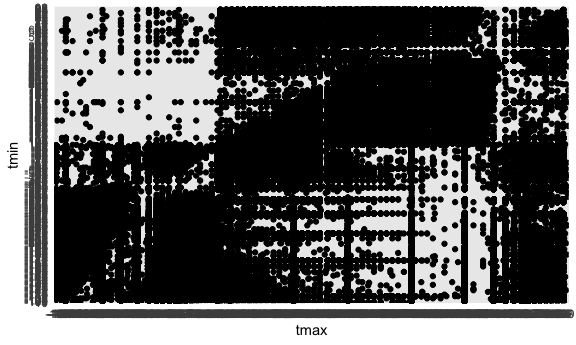

Homework 3
================
Ronae McLin rkm2147

``` r
library(tidyverse)
```

    ## ── Attaching packages ──────────────────────── tidyverse 1.3.0 ──

    ## ✓ ggplot2 3.3.2     ✓ purrr   0.3.4
    ## ✓ tibble  3.0.1     ✓ dplyr   1.0.0
    ## ✓ tidyr   1.1.0     ✓ stringr 1.4.0
    ## ✓ readr   1.3.1     ✓ forcats 0.5.0

    ## ── Conflicts ─────────────────────────── tidyverse_conflicts() ──
    ## x dplyr::filter() masks stats::filter()
    ## x dplyr::lag()    masks stats::lag()

``` r
library(patchwork)

knitr::opts_chunk$set(
  fig.width = 6,
  fig.asp = .6,
  out.width = "90%"
)
theme_set(theme_minimal() + theme(legend.position = "bottom"))

options(
  ggplot2.continuous.colour = "viridis",
  ggplot2.continuous.fill = "viridis"
)

scale_colour_discrete = scale_color_viridis_d

scale_fill_discrete = scale_fill_viridis_d
```

# Problem 1

``` r
library(p8105.datasets)
data("instacart")
```

Instacart is an online service that allows for users to shop locally
from various stores that can then be delivered within NYC. There are a
total of 1,384,617 observations contained within this dataset. This
dataset contains 1384617 rows and 15 columns. Observations are the level
of items in orders by user. Variables include: order\_id, product\_id,
add\_to\_cart\_order, reordered, user\_id, eval\_set, order\_number,
order\_dow, order\_hour\_of\_day, days\_since\_prior\_order,
product\_name, aisle\_id, department\_id, aisle, department.

**There are 134 aisles, and aisles in which the top 3 most ordered items
are ordered from are fresh vegetables, fresh fruits, and packaged
vegetables & fruits**

``` r
instacart %>% 
  count(aisle) %>% 
  arrange(desc(n))
```

    ## # A tibble: 134 x 2
    ##    aisle                              n
    ##    <chr>                          <int>
    ##  1 fresh vegetables              150609
    ##  2 fresh fruits                  150473
    ##  3 packaged vegetables fruits     78493
    ##  4 yogurt                         55240
    ##  5 packaged cheese                41699
    ##  6 water seltzer sparkling water  36617
    ##  7 milk                           32644
    ##  8 chips pretzels                 31269
    ##  9 soy lactosefree                26240
    ## 10 bread                          23635
    ## # … with 124 more rows

**Plot of items ordered from each aisle, more than 10000.**

``` r
instacart %>% 
  count(aisle) %>% 
  filter(n > 10000) %>% 
  ggplot(aes( x = aisle, y = n)) + geom_point() + theme(axis.text.x = element_text(angle = 270, vjust = 0.5, hjust = 1))
```


**A table showing the three most popular items in each of the aisles
“baking ingredients”, “dog food care”, and “packaged vegetables
fruits”.**

``` r
instacart %>% 
    filter(aisle %in% c("baking ingredients", "dog food care", "packaged vegetables fruits")) %>% 
    group_by(aisle) %>% 
    count(product_name) %>% 
    mutate(rank = min_rank(desc(n))) %>% 
    filter(rank < 4) %>% 
    arrange(aisle, rank) %>% 
    knitr::kable()
```

| aisle                      | product\_name                                 |    n | rank |
| :------------------------- | :-------------------------------------------- | ---: | ---: |
| baking ingredients         | Light Brown Sugar                             |  499 |    1 |
| baking ingredients         | Pure Baking Soda                              |  387 |    2 |
| baking ingredients         | Cane Sugar                                    |  336 |    3 |
| dog food care              | Snack Sticks Chicken & Rice Recipe Dog Treats |   30 |    1 |
| dog food care              | Organix Chicken & Brown Rice Recipe           |   28 |    2 |
| dog food care              | Small Dog Biscuits                            |   26 |    3 |
| packaged vegetables fruits | Organic Baby Spinach                          | 9784 |    1 |
| packaged vegetables fruits | Organic Raspberries                           | 5546 |    2 |
| packaged vegetables fruits | Organic Blueberries                           | 4966 |    3 |

**A table showing the mean hour of the day at which Pink Lady Apples and
Coffee Ice Cream are ordered on each day of the week**

``` r
instacart %>% 
  filter(product_name %in% c("Pink Lady Apples", "Coffee Ice Cream")) %>% 
  group_by(product_name, order_dow) %>% 
  summarize(mean_hour = mean(order_hour_of_day)) %>% 
  pivot_wider(
    names_from = order_dow,
    values_from = mean_hour
  ) %>% 
  knitr::kable()
```

    ## `summarise()` regrouping output by 'product_name' (override with `.groups` argument)

| product\_name    |        0 |        1 |        2 |        3 |        4 |        5 |        6 |
| :--------------- | -------: | -------: | -------: | -------: | -------: | -------: | -------: |
| Coffee Ice Cream | 13.77419 | 14.31579 | 15.38095 | 15.31818 | 15.21739 | 12.26316 | 13.83333 |
| Pink Lady Apples | 13.44118 | 11.36000 | 11.70213 | 14.25000 | 11.55172 | 12.78431 | 11.93750 |

# Problem 2

**Load data & Tidy the data appropriately **

``` r
accel_df = read_csv("./accel_data.csv") %>% 
  janitor::clean_names() %>% 
  mutate(
    day = as.factor(day)
  ) %>% 
  pivot_longer(
    activity_1:activity_1440,
    names_to = "minute",
    names_prefix = "activity_",
      values_to = "value"
  ) %>% 
  mutate(
    minute = as.numeric(minute)
  ) %>% mutate(
  weekday = if_else(day %in% c("Saturday", "Sunday"), "FALSE", "TRUE")) %>% 
  mutate(weekday = as.factor(weekday)
         ) %>%
  mutate(
    day =  
  forcats::fct_relevel(day, c("Monday", "Tuesday", "Wednesday", "Thursday","Friday","Saturday", "Sunday"))
  )
```

    ## Parsed with column specification:
    ## cols(
    ##   .default = col_double(),
    ##   day = col_character()
    ## )

    ## See spec(...) for full column specifications.

**The accelerometer data describes information collected on a 63
year-old male with congesitve heart failure. This data includes the
variables: week, day\_id, day, minute, value, weekday. The weekday
variable describes if observations occurred during the weekday (Mon-Fri)
or during the weekend (Sat-Sun). There are a total of 50400 observations
for this frame. Observations were collected for a total of 5 weeks.
There are 1440 minutes in a 24 hour period, so the amount of
observations seems appropriate**

``` r
accel_df %>% 
  group_by(day, week) %>% 
  summarize(sum_value = sum(value)) %>%
  pivot_wider(
    names_from = day,
    values_from = sum_value
  ) %>% 
  knitr::kable()
```

    ## `summarise()` regrouping output by 'day' (override with `.groups` argument)

| week |    Monday |  Tuesday | Wednesday | Thursday |   Friday | Saturday | Sunday |
| ---: | --------: | -------: | --------: | -------: | -------: | -------: | -----: |
|    1 |  78828.07 | 307094.2 |    340115 | 355923.6 | 480542.6 |   376254 | 631105 |
|    2 | 295431.00 | 423245.0 |    440962 | 474048.0 | 568839.0 |   607175 | 422018 |
|    3 | 685910.00 | 381507.0 |    468869 | 371230.0 | 467420.0 |   382928 | 467052 |
|    4 | 409450.00 | 319568.0 |    434460 | 340291.0 | 154049.0 |     1440 | 260617 |
|    5 | 389080.00 | 367824.0 |    445366 | 549658.0 | 620860.0 |     1440 | 138421 |

**From the created table, we can see a trend that the sum of activity is
the lowest on saturdays, notably during the fourth and fifth week.**

``` r
accel_df %>% 
ggplot(aes(x = minute, y = value, color = day, group = day_id)) + geom_line(alpha = .4) + geom_smooth(aes(group = day))
```

    ## `geom_smooth()` using method = 'gam' and formula 'y ~ s(x, bs = "cs")'


**From the observed plot, we can see that at the start of the 24 hour
period, activity is considerably low. We can assume that this is during
a period of rest/sleep. As the day progresses, activity level increases
appropriately, with a surge towards the end of the recording period.**

# Problem 3

``` r
library(p8105.datasets)
data("ny_noaa") 
```

**The NY NOAA is a large data set containing information for all New
York state weather stations from January 1, 1981 through December 31,
2010. Each weather station may collect only a subset of these variables,
and therefore the resulting dataset contains extensive missing data.
Variables include id, date, prcp, snow, snwd, tmax, tmin. There are a
total of 2595176 rows.**

``` r
ny_noaa = ny_noaa %>% 
separate(date, into = c("year", "month", "day"), convert = TRUE)
```

``` r
ny_noaa %>% 
  mutate(
   tmax = as.numeric(tmax),
    tmin = as.numeric(tmin)
  ) %>% 
  mutate(
    prcp = prcp / 10,
    tmax = tmax / 10,
    tmin = tmin / 10
  ) %>% 
    group_by(month) %>% 
    count(snow) %>% 
    mutate(rank = min_rank(desc(snow))) %>% 
  filter(rank < 5) %>%
  knitr::kable()
```

| month |  snow |      n | rank |
| ----: | ----: | -----: | ---: |
|     1 |   978 |      1 |    4 |
|     1 |  1105 |      1 |    3 |
|     1 |  1207 |      1 |    2 |
|     1 |  6350 |      1 |    1 |
|     2 |   762 |      5 |    4 |
|     2 |   775 |      1 |    3 |
|     2 |   838 |      1 |    2 |
|     2 |   892 |      1 |    1 |
|     3 |   864 |      1 |    4 |
|     3 |   914 |      3 |    3 |
|     3 |  1041 |      1 |    2 |
|     3 |  1067 |      1 |    1 |
|     4 |   762 |      1 |    4 |
|     4 |   940 |      1 |    3 |
|     4 |  7765 |      1 |    2 |
|     4 | 10160 |      1 |    1 |
|     5 |   229 |      2 |    4 |
|     5 |   249 |      1 |    3 |
|     5 |   272 |      1 |    2 |
|     5 |   305 |      1 |    1 |
|     6 |    15 |      1 |    4 |
|     6 |    25 |      1 |    3 |
|     6 |    33 |      1 |    2 |
|     6 |   216 |      1 |    1 |
|     7 |     0 | 190472 |    4 |
|     7 |     8 |      1 |    3 |
|     7 |    25 |      1 |    2 |
|     7 |    51 |      1 |    1 |
|     8 |     3 |      1 |    4 |
|     8 |    10 |      1 |    3 |
|     8 |    25 |      1 |    2 |
|     8 |   155 |      2 |    1 |
|     9 |    25 |      2 |    4 |
|     9 |    30 |      1 |    3 |
|     9 |    94 |      1 |    2 |
|     9 |   163 |      1 |    1 |
|    10 |   445 |      1 |    4 |
|    10 |   457 |      2 |    3 |
|    10 |   483 |      2 |    2 |
|    10 |   559 |      1 |    1 |
|    11 |   554 |      1 |    4 |
|    11 |   632 |      1 |    3 |
|    11 |   953 |      1 |    2 |
|    11 |  7122 |      1 |    1 |
|    12 |   861 |      1 |    4 |
|    12 |   871 |      1 |    3 |
|    12 |   965 |      1 |    2 |
|    12 |  1143 |      1 |    1 |

Make a two-panel plot showing the average max temperature in January and
in July in each station across years. Is there any observable /
interpretable structure? Any outliers?

``` r
ny_noaa %>% 
  mutate(
   tmax = as.numeric(tmax),
    tmin = as.numeric(tmin)
  )%>% 
  select(month, tmax, year) %>% 
  group_by(month, year) %>% 
  filter(month %in% c(1,7)) %>% 
  drop_na() %>% 
  summarize(mean_tmax = mean(tmax)) %>% 
  ggplot(aes(x = year, y = mean_tmax)) + geom_point() + geom_smooth() +
  labs(
    title = "jan and july average",
    x = "year information",
    y = "data i need"
  ) +
  facet_grid(~month, scales = "free_y")
```

    ## `summarise()` regrouping output by 'month' (override with `.groups` argument)

    ## `geom_smooth()` using method = 'loess' and formula 'y ~ x'


Make a two-panel plot showing (i) tmax vs tmin for the full dataset
(note that a scatterplot may not be the best option); and (ii) make a
plot showing the distribution of snowfall values greater than 0 and less
than 100 separately by year.

``` r
ny_noaa %>% 
  select(year, tmax, tmin) %>% 
  drop_na(tmax,tmin) %>% 
  ggplot(aes(x = tmax, y = tmin)) + geom_bin2d()
```


